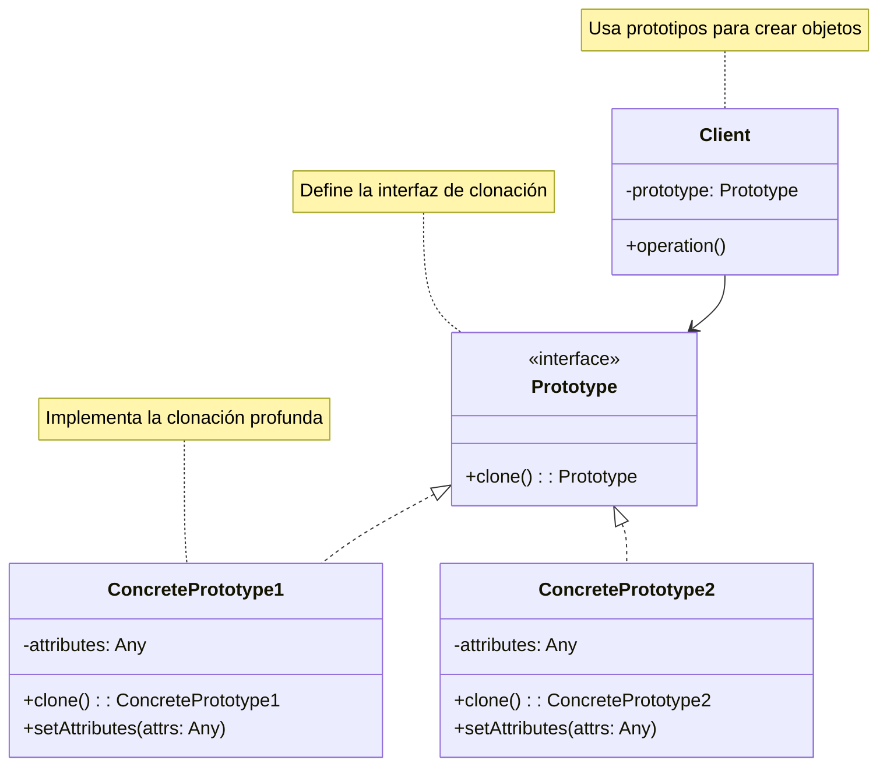
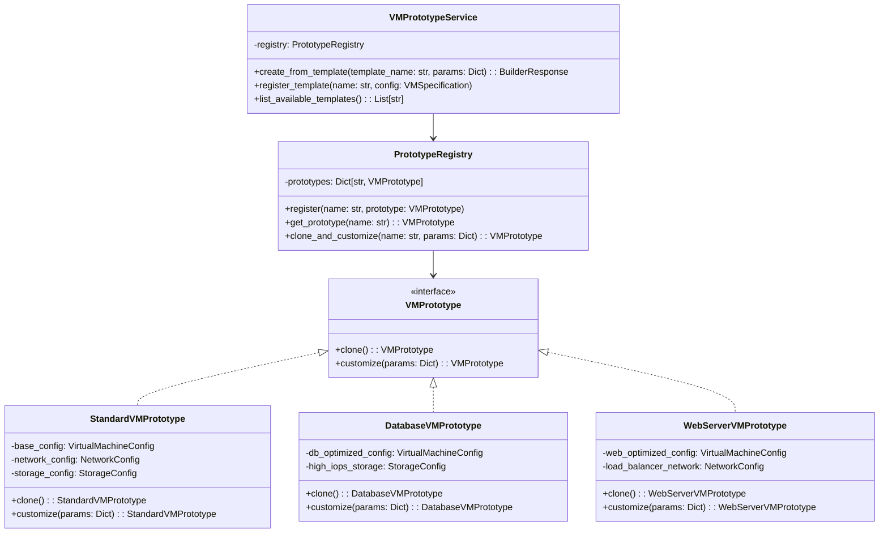
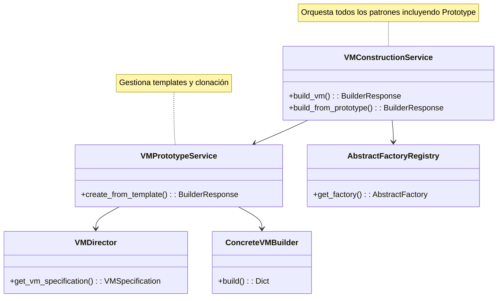

# Patrón de Diseño Prototype

## Análisis Académico del Patrón Prototype

### 1. Descripción del Patrón

El patrón **Prototype** es un patrón de diseño creacional que permite crear objetos mediante la clonación de instancias existentes (prototipos), en lugar de construirlos desde cero. Este patrón es especialmente útil cuando la creación de un objeto es costosa o compleja.

### 2. Objetivos

- **Evitar recreación costosa**: Clona objetos existentes en lugar de crear nuevos desde cero
- **Encapsular complejidad**: Oculta la complejidad de creación dentro del prototipo
- **Flexibilidad de configuración**: Permite crear variaciones de objetos a partir de prototipos base
- **Independencia de clases**: Permite crear objetos sin conocer sus clases específicas

### 3. Problemas que Resuelve

- **Alto costo de inicialización**: Cuando crear un objeto requiere operaciones costosas (consultas de BD, cálculos complejos, validaciones)
- **Configuraciones complejas**: Cuando un objeto requiere muchos parámetros de inicialización
- **Variaciones de objetos similares**: Cuando necesitas crear múltiples instancias con pequeñas diferencias
- **Desacoplamiento del cliente**: Cuando el cliente no debe conocer las clases concretas a instanciar

### 4. Estructura (Diagrama de Clases UML)



### 5. Ventajas

- **Rendimiento mejorado**: Evita operaciones costosas de inicialización
- **Flexibilidad**: Permite crear objetos con configuraciones complejas fácilmente
- **Desacoplamiento**: El cliente no necesita conocer las clases concretas
- **Variabilidad**: Facilita la creación de variaciones de objetos similares
- **Encapsulación**: La lógica de creación se mantiene dentro del prototipo

### 6. Desventajas

- **Complejidad de clonación**: Implementar clonación profunda puede ser complejo
- **Referencias circulares**: Problemas con objetos que se referencian entre sí
- **Uso de memoria**: Mantener prototipos en memoria puede consumir recursos
- **Versionado**: Cambios en prototipos pueden afectar todos los clones

### 7. Casos de Uso Comunes

- **Configuraciones de sistema**: Templates de configuración que se personalizan
- **Objetos de juegos**: Personajes, items, niveles con variaciones
- **Formularios web**: Templates de formularios que se adaptan según contexto
- **Configuraciones de red**: Templates de topologías que se replican
- **Documentos**: Templates que se personalizan para diferentes usuarios

## Implementación en Contexto Multi-Cloud

### 8. Integración con el Sistema de Proveedores Cloud

En nuestro sistema multi-cloud, el patrón Prototype se utiliza para:

1. **Templates de Configuración VM**: Crear prototipos de VMs con configuraciones estándar por proveedor
2. **Clonación de Ambientes**: Replicar configuraciones de desarrollo/staging a producción  
3. **Configuraciones Optimizadas**: Templates pre-optimizados para diferentes casos de uso
4. **Migración entre Proveedores**: Clonar configuraciones adaptándolas a diferentes providers

### 9. Casos de Uso Específicos

#### Caso 1: Templates de VM por Industria
- **Prototipo Web Server**: VM optimizada para servidores web con balanceador
- **Prototipo Database**: VM con configuración específica para bases de datos
- **Prototipo Analytics**: VM optimizada para procesamiento de big data

#### Caso 2: Migración de Ambientes
- **Development → Staging**: Clona configuración ajustando recursos
- **Staging → Production**: Clona con configuraciones de alta disponibilidad
- **Disaster Recovery**: Clona configuración en región diferente

#### Caso 3: Configuraciones Multi-Tenant
- **Template Base**: Configuración estándar compartida
- **Personalización por Cliente**: Clona y ajusta según requerimientos específicos

### 10. Beneficios en el Contexto Multi-Cloud

- **Consistencia**: Garantiza configuraciones consistentes entre ambientes
- **Eficiencia**: Evita recalcular configuraciones complejas
- **Portabilidad**: Facilita migración entre proveedores cloud
- **Escalabilidad**: Permite replicar configuraciones a gran escala

## Diagramas de Implementación

### Estructura del Patrón en el Sistema Multi-Cloud



### Integración con Patrones Existentes



## Ejemplo de Implementación

### Uso del API con Prototype

```bash
# 1. Crear VM desde template
POST /create_from_template
{
    "template_name": "web-server-standard",
    "provider": "AWS",
    "region": "us-east-1",
    "customizations": {
        "vcpus": 4,
        "memory_gb": 16,
        "environment": "production"
    }
}

# 2. Listar templates disponibles
GET /vm_templates

# 3. Registrar nuevo template
POST /register_template
{
    "template_name": "analytics-optimized",
    "vm_specification": { ... }
}
```

Esta implementación del patrón Prototype complementa los patrones existentes (Factory Method, Abstract Factory, Builder+Director) proporcionando una capa adicional de flexibilidad y eficiencia en la gestión de configuraciones VM predefinidas.