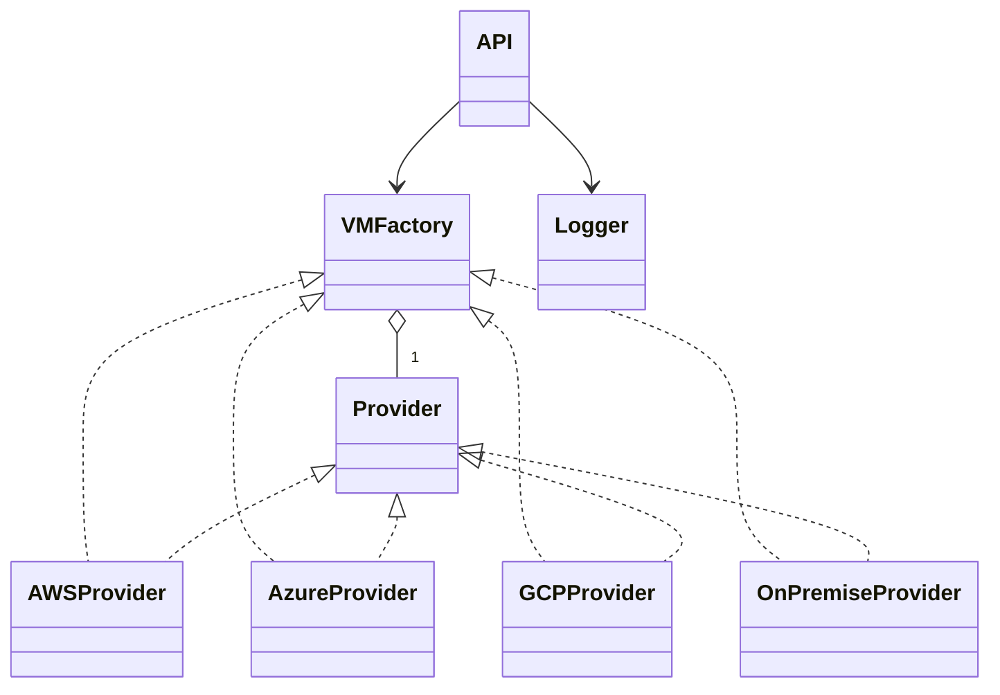

# API de Aprovisionamiento de Máquinas Virtuales Multi-Cloud

## Descripción
Esta API implementa el patrón de diseño Factory Method para aprovisionar máquinas virtuales en diferentes proveedores de nube (AWS, Azure, Google Cloud, On-Premise) de forma extensible, segura y mantenible.

## Objetivos
- Aplicar principios SOLID y el patrón Factory Method.
- Permitir la integración de nuevos proveedores sin modificar el controlador central.
- Registrar logs sin exponer información sensible.
- Proveer una API REST stateless y compatible con JSON.

## Estructura del Proyecto
- `api.py`: Controlador central de la API REST.
- `factory.py`: Fábrica de proveedores (Factory Method).
- `models.py`: Modelos de datos para solicitudes y respuestas.
- `logger.py`: Registro seguro de logs.
- `providers/`: Implementaciones de cada proveedor (AWS, Azure, GCP, OnPremise).
- `test_api.py`: Pruebas automáticas de la API.

## Diagrama de Clases (UML)



## Ejemplo de Uso

### Solicitud de aprovisionamiento (POST)

```
POST /provision_vm
Content-Type: application/json
{
  "provider": "aws",
  "params": {
    "instance_type": "t2.micro",
    "region": "us-east-1",
    "vpc": "vpc-123",
    "ami": "ami-456"
  }
}
```

### Respuesta exitosa
```
{
  "success": true,
  "vm_id": "aws-vm-123",
  "error": null
}
```

### Respuesta de error
```
{
  "success": false,
  "vm_id": null,
  "error": "Falta parámetro AWS: ami"
}
```

## Extensión para nuevos proveedores
Para agregar un nuevo proveedor, crea una clase en `providers/` y regístrala en la fábrica:
```python
from factory import VMFactory
from providers.oracle import OracleProvider
VMFactory.register_provider("oracle", OracleProvider)
```

## Pruebas automáticas
Ejecuta los tests con:
```
py -m pytest --maxfail=1 --disable-warnings -v test_api.py
```

## Cómo probar el API manualmente
1. Instala las dependencias:
   ```
   py -m pip install fastapi uvicorn
   ```
2. Ejecuta el servidor:
   ```
   py -m uvicorn api:app --reload
   ```
3. Abre tu navegador en:
   ```
   http://127.0.0.1:8000/docs
   ```
   Allí puedes probar el endpoint `/provision_vm` usando la documentación interactiva de Swagger.

## Referencias
- Gamma et al. "Design Patterns"
- Documentación oficial de FastAPI
- Material de clase UML y SOLID
