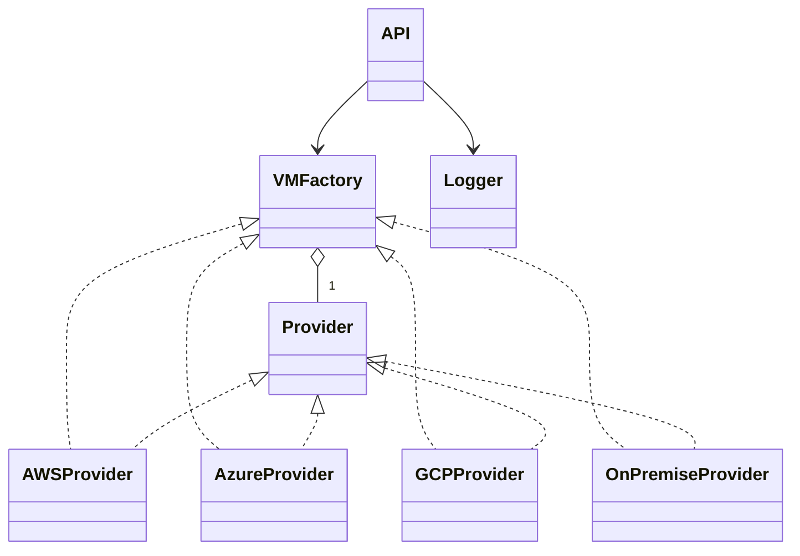

# API de Aprovisionamiento de Máquinas Virtuales Multi-Cloud

## Diagrama de Clases



## Uso

1. Ejecuta `main.py` para iniciar la API REST.
2. Realiza una solicitud POST a `/provision_vm` con JSON:
```json
{
  "provider": "aws",
  "params": {
    "instance_type": "t2.micro",
    "region": "us-east-1",
    "vpc": "vpc-123",
    "ami": "ami-xyz"
  }
}
```

## Extensión
Para agregar un nuevo proveedor, crea una clase en `providers/` y regístrala en `factory.py` sin modificar el controlador.

## Principios SOLID
- Dependency Inversion: El controlador depende de la abstracción `VMFactory`, no de implementaciones concretas.
- Open/Closed: Puedes agregar proveedores sin modificar el controlador.

## Seguridad
- Los logs filtran parámetros sensibles.

## Stateless
- La API no guarda estado entre solicitudes.
