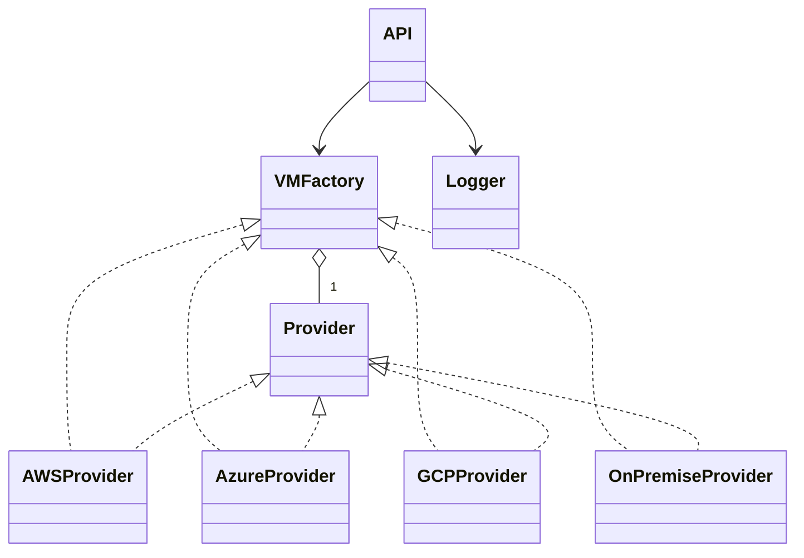

# API de Aprovisionamiento de Máquinas Virtuales Multi-Cloud

## Descripción
Esta API implementa los patrones de diseño **Factory Method** y **Abstract Factory** para aprovisionar máquinas virtuales individuales y familias completas de recursos (VM + Red + Disco) en diferentes proveedores de nube (AWS, Azure, Google Cloud, On-Premise) de forma extensible, segura y mantenible.

## Patrones Implementados

### 1. Factory Method (Implementación Original)
- Aprovisiona VMs individuales
- Un proveedor por VM
- Endpoint: `/provision_vm`

### 2. Abstract Factory (Nueva Implementación)
- Aprovisiona familias de recursos relacionados (VM + Red + Disco)
- Consistencia garantizada: todos los recursos del mismo proveedor
- Endpoint: `/provision_resource_family`

## Objetivos
- Aplicar principios SOLID y el patrón Factory Method.
- Permitir la integración de nuevos proveedores sin modificar el controlador central.
- Registrar logs sin exponer información sensible.
- Proveer una API REST stateless y compatible con JSON.

## Estructura del Proyecto

### Archivos Principales
- `api.py`: Controlador central de la API REST con ambos endpoints.
- `factory.py`: Fábrica de proveedores (Factory Method original).
- `abstract_factory.py`: Implementación del patrón Abstract Factory.
- `resources.py`: Definición de recursos (Network, Storage, VM) y sus implementaciones.
- `resource_provisioner.py`: Servicio de aprovisionamiento de familias de recursos.
- `models.py`: Modelos de datos para solicitudes y respuestas.
- `logger.py`: Registro seguro de logs.

### Proveedores
- `providers/`: Implementaciones originales de cada proveedor (AWS, Azure, GCP, OnPremise).

### Pruebas
- `test_api.py`: Pruebas del Factory Method original.
- `test_resource_families.py`: Pruebas del Abstract Factory.

### Documentación
- `ABSTRACT_FACTORY_DOCS.md`: Documentación académica detallada del patrón Abstract Factory.

## Diagrama de Clases (UML)



## Ejemplos de Uso

### 1. Factory Method - VM Individual

#### Solicitud de aprovisionamiento (POST)
```json
POST /provision_vm
Content-Type: application/json
{
  "provider": "aws",
  "params": {
    "instance_type": "t2.micro",
    "region": "us-east-1",
    "vpc": "vpc-123",
    "ami": "ami-456"
  }
}
```

#### Respuesta exitosa
```json
{
  "success": true,
  "vm_id": "aws-vm-123",
  "error": null
}
```

### 2. Abstract Factory - Familia de Recursos

#### Solicitud de aprovisionamiento (POST)
```json
POST /provision_resource_family
Content-Type: application/json
{
  "provider": "aws",
  "vm_params": {
    "instance_type": "t2.micro",
    "region": "us-east-1",
    "ami": "ami-123456"
  },
  "network_params": {
    "vpcId": "vpc-abc123",
    "subnet": "subnet-def456",
    "securityGroup": "sg-ghi789"
  },
  "storage_params": {
    "volumeType": "gp2",
    "sizeGB": 20,
    "encrypted": true
  }
}
```

#### Respuesta exitosa
```json
{
  "success": true,
  "provider": "AWS",
  "resources": [
    {
      "resource_id": "aws-net-123",
      "resource_type": "network", 
      "status": "disponible",
      "details": {
        "vpc_id": "vpc-abc123",
        "subnet": "subnet-def456",
        "security_group": "sg-ghi789",
        "status": "disponible"
      }
    },
    {
      "resource_id": "aws-vol-456",
      "resource_type": "storage",
      "status": "disponible", 
      "details": {
        "volume_type": "gp2",
        "size_gb": 20,
        "encrypted": true,
        "status": "disponible"
      }
    },
    {
      "resource_id": "aws-vm-789",
      "resource_type": "vm",
      "status": "aprovisionada",
      "details": {
        "instance_type": "t2.micro",
        "region": "us-east-1",
        "ami": "ami-123456",
        "network_id": "aws-net-123",
        "storage_id": "aws-vol-456",
        "status": "aprovisionada"
      }
    }
  ]
}
```

## Extensión para nuevos proveedores
Para agregar un nuevo proveedor, crea una clase en `providers/` y regístrala en la fábrica:
```python
from factory import VMFactory
from providers.oracle import OracleProvider
VMFactory.register_provider("oracle", OracleProvider)
```

## Pruebas automáticas

### Factory Method Original
```bash
py -m pytest test_api.py -v
```

### Abstract Factory (Familias de Recursos)
```bash
py -m pytest test_resource_families.py -v
```

### Todas las pruebas
```bash
py -m pytest -v
```

## Cómo probar el API manualmente

1. **Instala las dependencias:**
   ```bash
   py -m pip install fastapi uvicorn
   ```

2. **Ejecuta el servidor:**
   ```bash
   py -m uvicorn api:app --reload
   ```

3. **Abre la documentación interactiva:**
   ```
   http://127.0.0.1:8000/docs
   ```

4. **Endpoints disponibles:**
   - `/provision_vm`: Factory Method - VM individual
   - `/provision_resource_family`: Abstract Factory - Familia de recursos
   - `/supported_providers`: Lista de proveedores soportados

5. **Prueba con ejemplos:**
   - Usa los ejemplos JSON mostrados arriba
   - La documentación Swagger permite probar directamente desde el navegador

## Referencias
- Gamma et al. "Design Patterns"
- Documentación oficial de FastAPI
- Material de clase UML y SOLID

# Documentación académica de cada parte del código

## api.py
Este archivo define el controlador principal de la API REST usando FastAPI. Expone el endpoint `/provision_vm` que recibe solicitudes para aprovisionar máquinas virtuales en diferentes proveedores. Utiliza el modelo `VMRequest` para validar la entrada y `VMResponse` para estructurar la respuesta. El controlador delega la creación de la VM al proveedor correspondiente usando el patrón Factory Method y registra la solicitud en los logs de forma segura.

## factory.py
Implementa el patrón Factory Method. La clase `VMFactory` mantiene un registro de los proveedores disponibles y permite obtener la instancia adecuada según el nombre recibido. También permite registrar nuevos proveedores sin modificar el controlador central, cumpliendo el principio Open/Closed de SOLID.

## models.py
Define los modelos de datos usando Pydantic. `VMRequest` valida la estructura de la solicitud (proveedor y parámetros) y `VMResponse` define la respuesta estándar del API (éxito, id de VM, error). Esto asegura compatibilidad y validación automática de los datos recibidos.

## logger.py
Gestiona el registro de logs de las solicitudes. La función `safe_log` filtra los parámetros sensibles (como contraseñas o tokens) para evitar exponer información crítica en los registros, cumpliendo con los requisitos de seguridad.

## providers/aws.py
Contiene la clase `AWSProvider` que implementa la lógica específica para aprovisionar una VM en AWS. Valida los parámetros requeridos y simula la creación de la máquina virtual, devolviendo el resultado correspondiente.

## providers/azure.py
Define la clase `AzureProvider` con la lógica para aprovisionar VMs en Azure. Valida los parámetros necesarios y retorna el resultado de la operación.

## providers/gcp.py
Incluye la clase `GCPProvider` para la creación de VMs en Google Cloud. Realiza la validación de parámetros y simula la respuesta del proveedor.

## providers/onpremise.py
Implementa la clase `OnPremiseProvider` para aprovisionar máquinas virtuales en infraestructura local (VMWare/KVM). Valida los recursos físicos y retorna el resultado.

## test_api.py
Archivo de pruebas automáticas usando pytest y FastAPI TestClient. Verifica que el endpoint `/provision_vm` funcione correctamente para todos los proveedores, incluyendo casos de éxito y error. Garantiza la calidad y el correcto funcionamiento del sistema.

---
Cada parte del código está diseñada para ser extensible, mantenible y segura, siguiendo los principios SOLID y el patrón Factory Method. Puedes estudiar cada archivo para entender cómo se desacopla la lógica de los proveedores y cómo se facilita la integración de nuevos servicios en el futuro.
