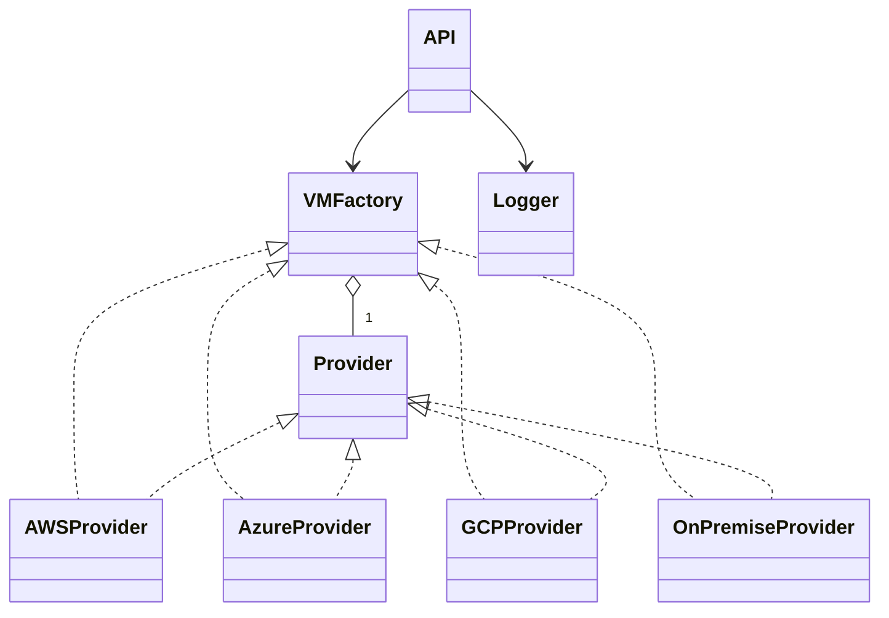

# API de Aprovisionamiento de Máquinas Virtuales Multi-Cloud

## Descripción
Esta API implementa el patrón de diseño Factory Method para aprovisionar máquinas virtuales en diferentes proveedores de nube (AWS, Azure, Google Cloud, On-Premise) de forma extensible, segura y mantenible.

## Objetivos
- Aplicar principios SOLID y el patrón Factory Method.
- Permitir la integración de nuevos proveedores sin modificar el controlador central.
- Registrar logs sin exponer información sensible.
- Proveer una API REST stateless y compatible con JSON.

## Estructura del Proyecto
- `api.py`: Controlador central de la API REST.
- `factory.py`: Fábrica de proveedores (Factory Method).
- `models.py`: Modelos de datos para solicitudes y respuestas.
- `logger.py`: Registro seguro de logs.
- `providers/`: Implementaciones de cada proveedor (AWS, Azure, GCP, OnPremise).
- `test_api.py`: Pruebas automáticas de la API.

## Diagrama de Clases (UML)



## Ejemplo de Uso

### Solicitud de aprovisionamiento (POST)

```
POST /provision_vm
Content-Type: application/json
{
  "provider": "aws",
  "params": {
    "instance_type": "t2.micro",
    "region": "us-east-1",
    "vpc": "vpc-123",
    "ami": "ami-456"
  }
}
```

### Respuesta exitosa
```
{
  "success": true,
  "vm_id": "aws-vm-123",
  "error": null
}
```

### Respuesta de error
```
{
  "success": false,
  "vm_id": null,
  "error": "Falta parámetro AWS: ami"
}
```

## Extensión para nuevos proveedores
Para agregar un nuevo proveedor, crea una clase en `providers/` y regístrala en la fábrica:
```python
from factory import VMFactory
from providers.oracle import OracleProvider
VMFactory.register_provider("oracle", OracleProvider)
```

## Pruebas automáticas
Ejecuta los tests con:
```
py -m pytest --maxfail=1 --disable-warnings -v test_api.py
```

## Cómo probar el API manualmente
1. Instala las dependencias:
   ```
   py -m pip install fastapi uvicorn
   ```
2. Ejecuta el servidor:
   ```
   py -m uvicorn api:app --reload
   ```
3. Abre tu navegador en:
   ```
   http://127.0.0.1:8000/docs
   ```
   Allí puedes probar el endpoint `/provision_vm` usando la documentación interactiva de Swagger.

## Referencias
- Gamma et al. "Design Patterns"
- Documentación oficial de FastAPI
- Material de clase UML y SOLID

# Documentación académica de cada parte del código

## api.py
Este archivo define el controlador principal de la API REST usando FastAPI. Expone el endpoint `/provision_vm` que recibe solicitudes para aprovisionar máquinas virtuales en diferentes proveedores. Utiliza el modelo `VMRequest` para validar la entrada y `VMResponse` para estructurar la respuesta. El controlador delega la creación de la VM al proveedor correspondiente usando el patrón Factory Method y registra la solicitud en los logs de forma segura.

## factory.py
Implementa el patrón Factory Method. La clase `VMFactory` mantiene un registro de los proveedores disponibles y permite obtener la instancia adecuada según el nombre recibido. También permite registrar nuevos proveedores sin modificar el controlador central, cumpliendo el principio Open/Closed de SOLID.

## models.py
Define los modelos de datos usando Pydantic. `VMRequest` valida la estructura de la solicitud (proveedor y parámetros) y `VMResponse` define la respuesta estándar del API (éxito, id de VM, error). Esto asegura compatibilidad y validación automática de los datos recibidos.

## logger.py
Gestiona el registro de logs de las solicitudes. La función `safe_log` filtra los parámetros sensibles (como contraseñas o tokens) para evitar exponer información crítica en los registros, cumpliendo con los requisitos de seguridad.

## providers/aws.py
Contiene la clase `AWSProvider` que implementa la lógica específica para aprovisionar una VM en AWS. Valida los parámetros requeridos y simula la creación de la máquina virtual, devolviendo el resultado correspondiente.

## providers/azure.py
Define la clase `AzureProvider` con la lógica para aprovisionar VMs en Azure. Valida los parámetros necesarios y retorna el resultado de la operación.

## providers/gcp.py
Incluye la clase `GCPProvider` para la creación de VMs en Google Cloud. Realiza la validación de parámetros y simula la respuesta del proveedor.

## providers/onpremise.py
Implementa la clase `OnPremiseProvider` para aprovisionar máquinas virtuales en infraestructura local (VMWare/KVM). Valida los recursos físicos y retorna el resultado.

## test_api.py
Archivo de pruebas automáticas usando pytest y FastAPI TestClient. Verifica que el endpoint `/provision_vm` funcione correctamente para todos los proveedores, incluyendo casos de éxito y error. Garantiza la calidad y el correcto funcionamiento del sistema.

---
Cada parte del código está diseñada para ser extensible, mantenible y segura, siguiendo los principios SOLID y el patrón Factory Method. Puedes estudiar cada archivo para entender cómo se desacopla la lógica de los proveedores y cómo se facilita la integración de nuevos servicios en el futuro.
