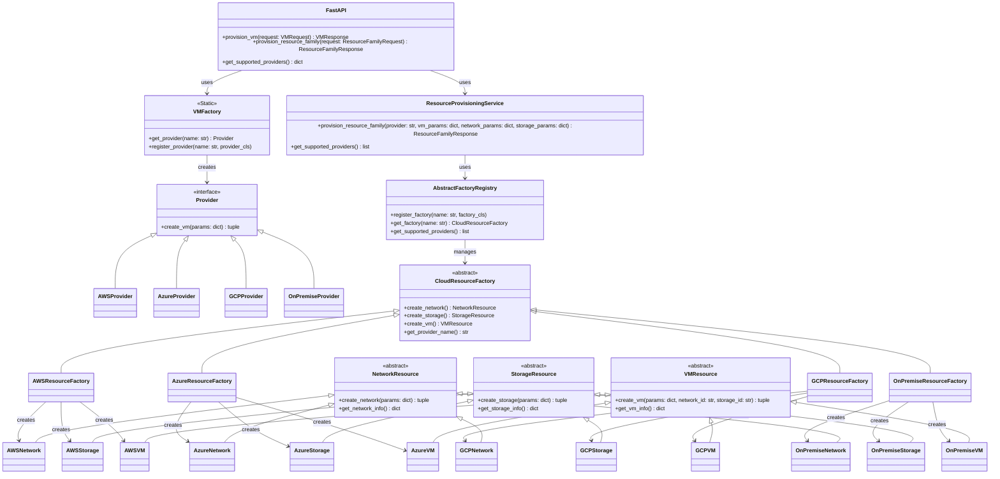
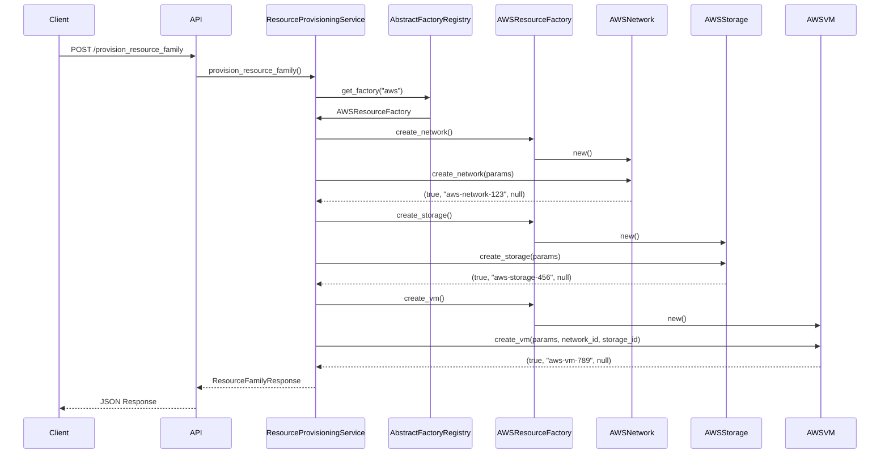

# Diagrama UML - Patrones Factory Method y Abstract Factory

## Diagrama de Clases Completo



## Diagrama de Secuencia - Aprovisionamiento de Familia de Recursos



## Patrón Strategy - Selección de Factory

```mermaid
classDiagram
    class AbstractFactoryRegistry {
        -factories: dict
        +register_factory(name, factory)
        +get_factory(name) CloudResourceFactory
    }
    
    AbstractFactoryRegistry --> CloudResourceFactory : selects strategy
    
    note for AbstractFactoryRegistry : "Implementa Strategy Pattern para seleccionar la factory apropiada según el proveedor"
```